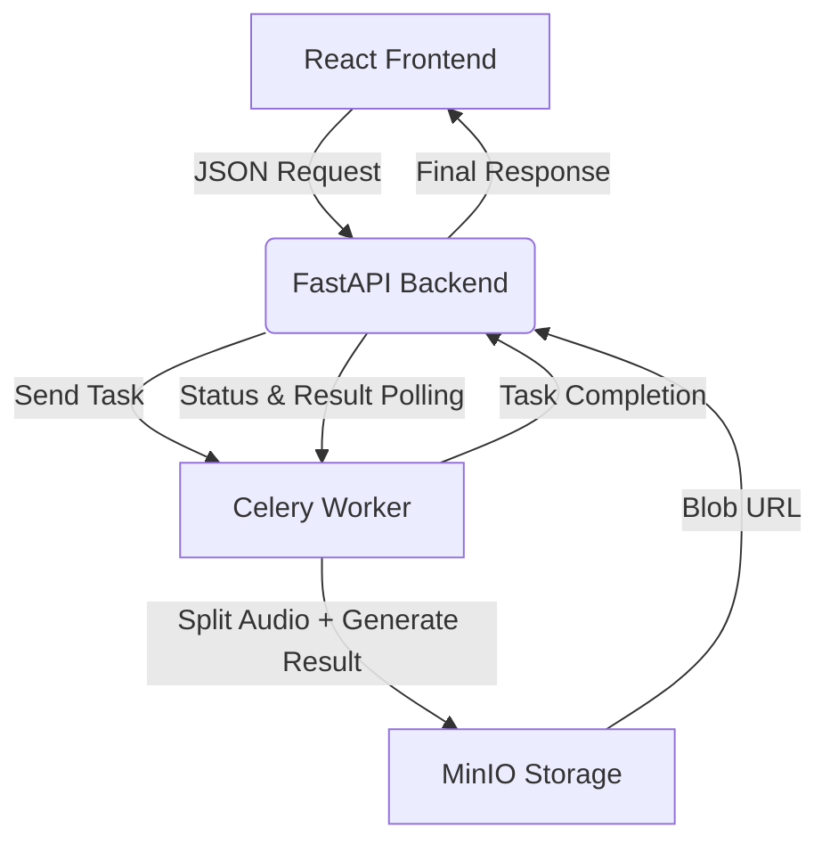

# 🎧 YASS AI

[https://yass-ai.com](https://yass-ai.com)

YouTube Audio Separation and Streaming AI  
유튜브 음원 분리(보컬, 반주 파일), 스트리밍 및 다운로드 가능  
AI 기반 음원 분리(Spleeter), yt-dlp 기반 오디오 다운로드, Blob 스트리밍 기반 웹플레이어
Edge-TTS 기반 음성 생성

---

> 음원 분리, AI Cover(추론) 및 맞춤형 음성 학습 모델 생성, TTS 시연 영상  
> 초기 프로젝트 버전(서버 배포 X)

---

## 🔍 **Features**

- ✅ **YouTube Search**: 유튜브 영상 검색 및 썸네일 리스트 제공
- 🎤 **Audio Separation**: 보컬/반주 분리 (powered by Spleeter)
- 🎧 **Streaming & Download**: 브라우저 내 실시간 재생 및 다운로드
- 🧠 **Text-to-Speech**: Edge-TTS 기반 자연스러운 음성 생성
- 🌀 **Async Processing**: Celery + Redis 비동기 작업 큐
- 📦 **Object Storage**: MinIO 기반 파일 저장 및 자동 삭제
- 🚀 **FastAPI + React** 기반 실시간 처리 구조

---

## 🌐 **URL**

👉 [yass-ai.com](https://yass-ai.com)

---

## ⚙️ **Architecture Overview**

---

## 🛠️ **Tech Stack**

### **Frontend**

- **React** with **Material UI (MUI)**
- Blob 기반 오디오 스트리밍 및 다운로드 구현

### **Backend**

- **FastAPI** (메인 API 서버)
- **yt-dlp**: YouTube 오디오 다운로드
- **Spleeter**: 오디오 소스 분리 (보컬/반주)
- **Edge-TTS**: 자연스러운 TTS 합성

### **Infrastructure**

- **Celery + Redis**: 비동기 태스크 큐 구조
- **MinIO**: 오디오 파일 저장용 객체 스토리지
- **Docker**: 프론트엔드 + 서브 인프라용 컨테이너화 구성
- **Nginx + Certbot**: HTTPS 인증 및 리버스 프록시

> ⚠️ **FastAPI 백엔드는 현재 Docker 외부(user1)** 환경에서 실행 중입니다.  
> 인증 유지 기반 yt-dlp의 `--cookies-from-browser` 옵션을 활용하기 위해 Chrome 로그인 환경(user1 세션)의 쿠키를 직접 접근해야 하며, 이는 Docker 내에서 불가능하므로 Docker 외부 실행으로 구조를 전환했습니다.

---

## 🔁 **요청 & 응답 흐름 (비동기 기반)**

1. **프론트엔드**: 유저가 YouTube URL 또는 텍스트(TTS)를 입력하고 요청
2. **FastAPI**: 요청을 Celery 태스크로 위임하고 task_id 반환
3. **Celery Worker**: yt-dlp로 오디오 다운로드, Spleeter로 분리 / Edge-TTS로 합성
4. **MinIO**: 처리된 결과 파일 저장 (일정 시간 후 자동 삭제 정책 적용)
5. **FastAPI**: 주기적으로 task_id 기반 결과를 확인하여 Blob URL 응답
6. **프론트엔드**: Blob URL로 실시간 재생 또는 다운로드 제공

---

## 🧠 **만든 이유**

- 직접 필요해서 만듦
- 아무도 개발 안 시켜줘서 내가 만듦
- 실전에서 돌아가는 AI 웹 서비스를 만들고 싶었음

---

## 📬 **Contact**

📧 [taedyoverflow@gmail.com](mailto:taedyoverflow@gmail.com)  
🧠 Made by Taedy