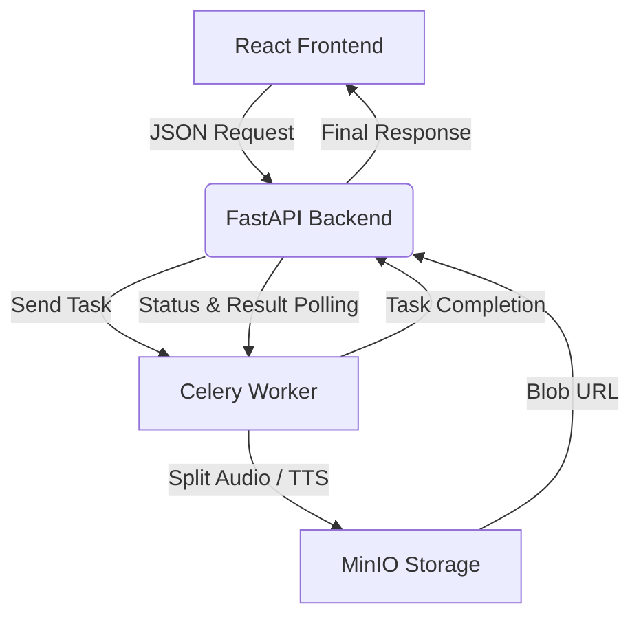

# 🎧 YASS AI

🔗 **Live URL**: [https://yass-ai.com](https://yass-ai.com)

YouTube Audio Separation and Streaming AI  
유튜브 음원을 검색하고 URL을 입력하면,  
Spleeter AI를 통해 보컬과 반주(MR)를 분리할 수 있습니다.  
또한 텍스트 입력만으로 자연스러운 음성을 생성하는  
Edge-TTS 기반 TTS(Text-to-Speech) 기능도 함께 제공합니다.  
분리된 음원과 변환된 음성은 스트리밍하거나 다운로드할 수 있습니다.
- (※ 기존 Blob 방식 대신 URL 기반 처리 방식으로 변경하여 모바일 호환성 및 속도 개선)

---

> 음원 분리, AI 커버 추론, TTS 시연 영상입니다.  
> (※ 초기 버전이며 로컬 환경에서만 구동(서버 미배포))

---

## 🔍 Features

- ✅ **YouTube Search**: 유튜브 영상 검색 및 썸네일 리스트 제공
- 🎤 **Audio Separation**: 보컬 / 반주 분리 (powered by Spleeter)
- 🎧 **Streaming & Download**: 
-     - ✅ **초기엔 Blob 스트리밍**을 사용했지만,
-     - 📱 모바일 Chrome/Safari의 미디어 재생 이슈, 속도 저하 등을 고려하여
-     - 현재는 **MinIO의 URL 기반 스트리밍/다운로드 방식**으로 전환
- 🗣️ **Text-to-Speech**: Edge-TTS 기반 자연스러운 음성 생성
- 🌀 **Async Processing**: Celery + Redis 기반 비동기 작업 처리
- 📦 **Object Storage**: MinIO에 결과 파일 저장 (일정 시간 후 자동 삭제)
- 🔁 **Singleton-Based Audio Separation**: Spleeter 싱글톤 + 락 기반 실행 안정성 강화
- ⚡ **FastAPI + React** 실시간 처리 웹서비스 구조
- 🔄 **Pagination Scroll Reset**: 페이징(Next/Prev) 시 자동 스크롤 맨 위 이동 UX 개선

---

## 🌐 Architecture

---

## 🛠️ Tech Stack

### 🔹 Frontend

- React (with Material UI)
- 초기에는 Blob 기반 오디오 스트리밍 및 다운로드 기능 구현
- → 현재는 **MinIO의 정적 URL을 직접 사용**하여 브라우저 호환성과 속도 개선
- **Pagination UX 개선**: 페이지 전환 시 자동 스크롤 최상단 이동

### 🔹 Backend

- FastAPI (메인 API 서버)
- yt-dlp: YouTube 오디오 다운로드
- Spleeter: 오디오 소스 분리 (보컬/반주)
  - ✅ **싱글톤(Singleton) + 락 기반 처리**로 TensorFlow Nesting 오류 회피 및 리소스 효율성 향상
- Edge-TTS: 텍스트 음성 합성 (TTS)

### 🔹 Infrastructure

- Celery + Redis: 비동기 작업 큐
- MinIO: 오디오 파일 저장용 객체 스토리지
- Docker: 프론트엔드 및 서브 인프라 구성
- Nginx + Certbot: HTTPS 인증 + 리버스 프록시

> ⚠️ **FastAPI 백엔드는 현재 Docker 외부 (`user1` 환경)에서 실행 중입니다.**  
> `yt-dlp`의 `--cookies-from-browser chrome` 옵션을 통해 로그인된 Chrome 쿠키를 활용하기 위함이며,  
> 이는 Docker 컨테이너 내부에서는 작동하지 않기 때문에 Docker 외부 실행으로 구조를 전환했습니다.

---

## 🔁 비동기 요청 처리 흐름

1. 유저가 YouTube URL 또는 TTS 텍스트 입력 후 요청
2. FastAPI는 해당 요청을 Celery 태스크로 전달하고 `task_id` 반환
3. Celery Worker는 yt-dlp로 오디오 다운로드 → Spleeter 분리 or TTS 합성
4. MinIO에 결과 파일 저장 (일정 시간 후 자동 삭제)
5. FastAPI는 task_id 기반으로 상태 및 결과를 주기적으로 확인
- 6. 완료된 결과 파일은 MinIO의 정적 URL로 프론트에 전달됨
- 7. 프론트는 해당 URL을 `<audio>`의 `src`로 사용하여 즉시 스트리밍 가능하며,
      다운로드 링크에도 동일한 URL 사용

---

## 💡 만든 이유

- 직접 필요해서 만들었어요
- 아무도 개발 안 시켜줘서 스스로 만들어봤습니다
- 실전에서 돌아가는 AI 웹서비스를 구현해보고 싶었어요

---

## 📬 Contact

📧 [taedyoverflow@gmail.com](mailto:taedyoverflow@gmail.com)  
🧠 Made by **Taedy**